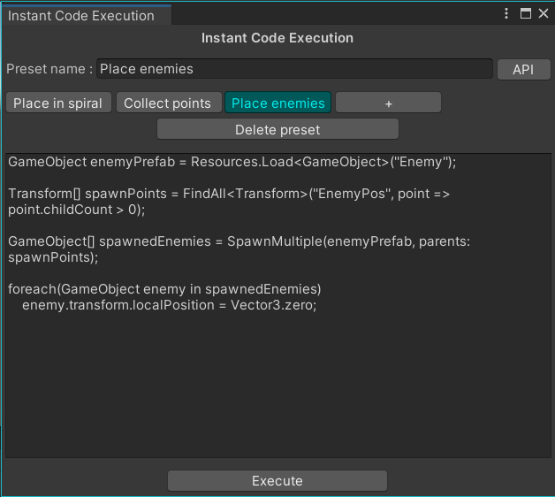

# **I**nstant **C**ode **E**xecution

_This tool is a Unity editor tool._

I.C.E. is a Unity editor tool used to execute code in the editor outside of play mode.

_(Yes. This is a Neuromancer reference)_

## Usage

In the Unity Editor, in the top menu bar, under the "Tools" tab you'll find the "ICE" option.\
This will open the I.C.E. editor window.

### Presets

The editor code you type is separated into _presets_ you can save, rename and delete using the top section.\
Clicking the "+" button will add a new preset.

### Code

In the big input box you can type your preset code.\
This does not hold any of your IDE/code editor features.

Everytime the code changes it is saved to its preset.

### API documentation

This tool provides the following methods to ease code writing :

- `Find` : Used to find an object in the current scene.
- `FindAll` : Used to find mutlitple objects in the current scene.
- `SpawnMultiple` : Used to spawn multiple objects in the scene.
- `SpawnMultipleWithPrefabLink` : Used to spawn multiple prefabs in the scene and retain the prefab link.
- `PlaceOnLine` : Places multiple objects in a line.
- `PlaceOnCircle` : Places multiple objects in a circle.
- `SnapToGrid` : Snaps objects positions to a provided grid size.
- `GetAsset` : Gets a reference to an asset.

Press the "API" button to open the documentation windown with the full methods details and available overrides.

### Execution

Press the "Execute" button to compile and execute your code.\
This will trigger and assembly reload and execute your code immediately.

This tool generates a script called "**ICE.cs**" in the "Assets/" directory, a script with the same name and path will be overwritten.

### Code errors

In case the code doesn't compile, the ICE.cs script will stay in your codebase at "Assets/ICE.cs" and the Unity console will provide you with error descriptions.

If the ICE.cs script compiles it will get executed.

## Support

This tool supports most of the C# features that your current Unity version supports, except for the following :

- "using" keyword to reference libraries can't be used given the structure of the generated code.
- multiple ICE execution is disabled, only one script can be executed at a time, therefore references between ICE scripts will not compile.

The libraries included in the generated code are :

- System
- System.Collections;
- System.Collections.Generic;
- System.IO;
- System.Linq;
- UnityEditor;
- UnityEditor.SceneManagement;
- UnityEngine;
- UnityEngine.SceneManagement;
- UnityEngine.UI;

The generated code also holds two aliasses :

- `Object` for **UnityEngine.Object**
- `Random` for **UnityEngine.Random**

If you want to use the _System_ variant you'll have to specify the class name fully (_System.Object_).